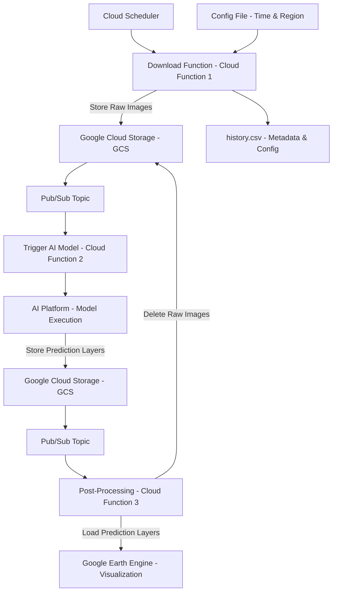

# Marine_Litter

## Project Overview

This project focuses on addressing the environmental issue of marine litter by leveraging artificial intelligence. Our AI model is designed to detect trash in the ocean using satellite imagery. By analyzing these images, the model identifies areas heavily impacted by marine debris, enabling targeted clean-up efforts and contributing to marine conservation. This innovative approach aims to enhance the efficiency of environmental protection measures, providing a scalable solution to one of the pressing challenges our oceans face today. 

## Additional Information
- Training data set is limited available and manually curated [MARIDA](https://journals.plos.org/plosone/article?id=10.1371/journal.pone.0262247) - 1381 images 256x256 pixel-sized labeled patches from images with resolution between 10 and 20m
- It use the Sentinel-2 satellite images [Link](https://sentiwiki.copernicus.eu/web/s2-mission)
- Sentinel-2 images are provided on two different levels [Level-2A or Level-1C](https://developers.google.com/earth-engine/datasets/catalog/sentinel-2)
- The satellite provides 13 [bands](https://sentiwiki.copernicus.eu/web/s2-mission) with a resolution from 10 to 60 m per pixel
- The satillite provide every 2-5 days an image of the same position [OE Browser](https://apps.sentinel-hub.com/eo-browser/?zoom=7&lat=43.77903&lng=12.95288&themeId=DEFAULT-THEME&visualizationUrl=U2FsdGVkX1%2Fo0MQMJMe9reZjbTR8h6F3Bk2e%2Bt0%2BuBNt2bdf%2BpUw5HUYZC%2BC6Zk1zVnenS9oXT%2BsMh%2B3%2FKwyedQZfEsnQgMEFJM1EjcNTvaGB%2B%2BWdB%2B2PMxbpGD06QXc&datasetId=S2L2A&fromTime=2019-07-15T00%3A00%3A00.000Z&toTime=2019-07-15T23%3A59%3A59.999Z&layerId=1_TRUE_COLOR&demSource3D=%22MAPZEN%22)
- By adding more databases like ship position and enhancing the segmentation of the labeled data from [MARIDA](https://journals.plos.org/plosone/article?id=10.1371/journal.pone.0262247) an Unet++ model reached ~86 % accuracy. [Paper](https://arxiv.org/pdf/2307.02465)
- Model and code is publicly available ([Code](https://github.com/MarcCoru/marinedebrisdetector))
- This model was used to create prediction layer images (locally) for few regions at different timepoints
- Coordinates of marine regions are available [Link](https://www.marineregions.org/gazetteer.php?p=details&id=3314)

## Current Prototyp
- To make these prediction images available, [Google Earth Engine](https://earthengine.google.com/) was used to create a free user interface publicly available
- GEE can directly access images from satellite and layer can be uploaded manually or with GCP
- The code is written in JavaScript
- Prototype is already available ([MI4People-MarineLitter](https://mi4people.projects.earthengine.app/view/marine-litter)) and highlights in red potential marine litter

## Repository Structure

- **/docs** - Contains all project instructions and complete documentation.
- **/diagrams** - UML diagrams and other architectural representations.
- **/src** - Source code of the project.

- **ToDo's** will be managed under ["issues"](https://github.com/MI4People/Marine_Litter/issues/1)

## Branching Strategy

We use a specific naming convention for branches to maintain clarity:

- **Feature-Branches**: `feature/<featurename>_<YYYYMMDD>`
- **Bugfix-Branches**: `bugfix/<bugname>_<YYYYMMDD>`

## Flow-Diagram for Automation

## Flow-Diagram with Webinterface

