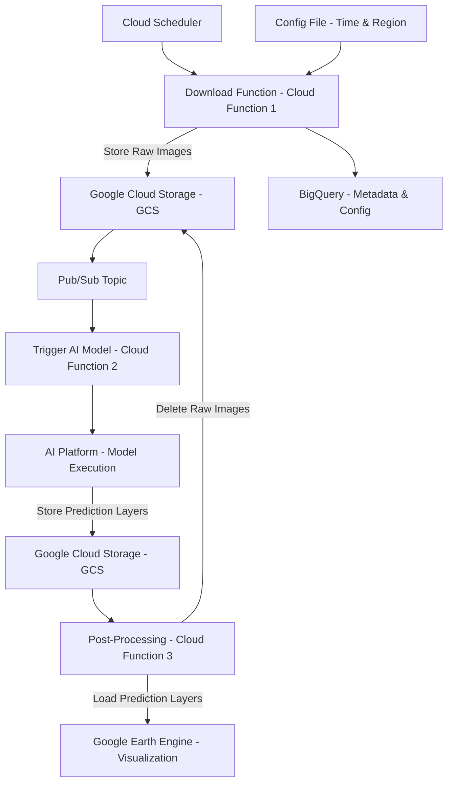
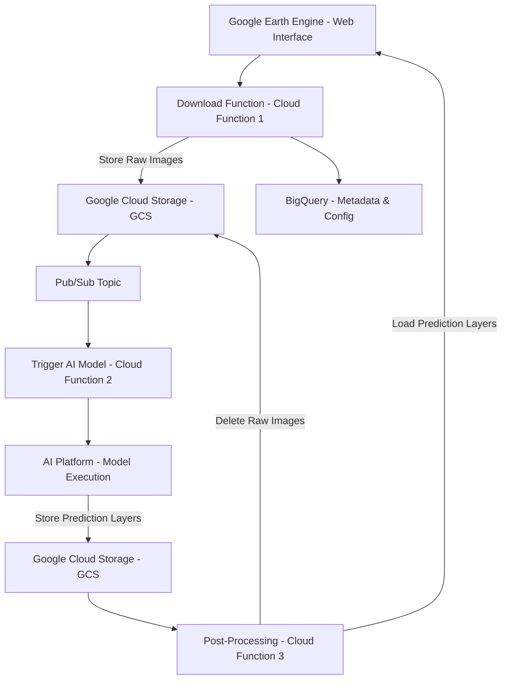

# Marine_Litter

## Project Overview

This project focuses on addressing the environmental issue of marine litter by leveraging artificial intelligence. Our AI model is designed to detect trash in the ocean using satellite imagery. By analyzing these images, the model identifies areas heavily impacted by marine debris, enabling targeted clean-up efforts and contributing to marine conservation. This innovative approach aims to enhance the efficiency of environmental protection measures, providing a scalable solution to one of the pressing challenges our oceans face today. 

## Repository Structure

- **/docs** - Contains all project instructions and complete documentation.
- **/diagrams** - UML diagrams and other architectural representations.
- **/src** - Source code of the project.

## Branching Strategy

We use a specific naming convention for branches to maintain clarity:

- **Feature-Branches**: `feature/<featurename>_<YYYYMMDD>`
- **Bugfix-Branches**: `bugfix/<bugname>_<YYYYMMDD>`

## Flow-Diagram for Automation

## Flow-Diagram with Webinterface

