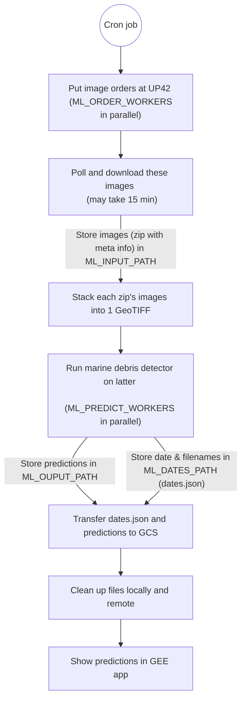

# Marine Litter

## Project Overview
This project of [MI4People](https://www.mi4people.org) addresses the environmental issue of marine litter by leveraging
artificial intelligence. The project home page is
[Marine Litter Detection via Satellites](https://www.mi4people.org/marinelitterdetectionviasatellites).

Our AI model is designed to detect trash in the ocean using satellite imagery.
By analyzing these images, the model identifies areas heavily impacted by marine debris, enabling targeted clean-up
efforts and contributing to marine conservation.
This innovative approach aims to enhance the efficiency of environmental protection measures, providing a scalable
solution to one of the pressing challenges our oceans face today.

There is a live demo **prototype** at
[Google Earth Engine Apps](https://mi4people.projects.earthengine.app/view/marine-litter),
which is written in JavaScript,
to provide a publicly available user interface that highlights potential marine litter in
red.

!!! note ""
    _This documentation uses [MkDocs](https://mkdocs.readthedocs.io/).
    For contributions, issues, releases, …, see
    [the GitHub project documentation (README.md)](https://github.com/MI4People/Marine_Litter)._

## Technical Details

### Data Sources
- **Training Dataset:** [MARIDA](https://journals.plos.org/plosone/article?id=10.1371/journal.pone.0262247)
  — 1,381 manually curated images (256x256 pixel patches) with 10-20 m resolution
- **Satellite Images:** [Sentinel-2](https://sentiwiki.copernicus.eu/web/s2-mission) with 13 bands, 10-60 m resolution
  - Processing levels: Level-2A or Level-1C
  - Update frequency: 2-5 days for new images of the same location
- **Marine Regions:** Coordinates from
  [marineregions.org](https://www.marineregions.org/gazetteer.php?p=details&id=3314)

### Browse the Satellite Data
Explore Sentinel-2 images using the [EO Browser](https://apps.sentinel-hub.com/eo-browser/?zoom=7&lat=43.77903&lng=12.95288&themeId=DEFAULT-THEME&visualizationUrl=U2FsdGVkX1%2Fo0MQMJMe9reZjbTR8h6F3Bk2e%2Bt0%2BuBNt2bdf%2BpUw5HUYZC%2BC6Zk1zVnenS9oXT%2BsMh%2B3%2FKwyedQZfEsnQgMEFJM1EjcNTvaGB%2B%2BWdB%2B2PMxbpGD06QXc&datasetId=S2L2A&fromTime=2019-07-15T00%3A00%3A00.000Z&toTime=2019-07-15T23%3A59%3A59.999Z&layerId=1_TRUE_COLOR&demSource3D=%22MAPZEN%22).

### Model Performance
By enhancing segmentation and adding ship position databases, the UNet++ model achieves ~86% accuracy.
The model and code are publicly available:
- **Research Paper:** https://arxiv.org/abs/2307.02465, based on https://arxiv.org/abs/1807.10165
- **Original Code:** https://github.com/MarcCoru/marinedebrisdetector

## Usage

### Pipeline
The system automatically processes satellite imagery and updates predictions.

The Google Earth Engine (GEE) app can directly access satellite images and prediction layers that are uploaded to
Google Cloud Storage (GCS).

### Viewing the Predictions
1. Visit the [live prototype](https://mi4people.projects.earthengine.app/view/marine-litter)
2. Navigate to your area of interest
3. Red highlights indicate potential marine litter locations
4. Use the time slider to view historical data
